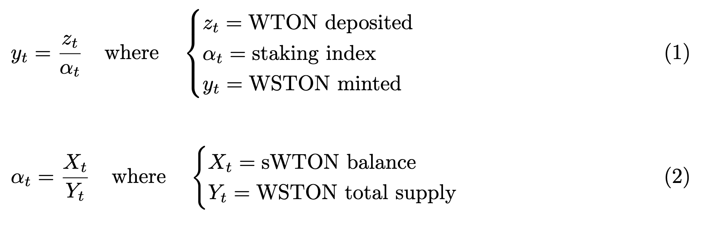

## WrappedStakedTON Token

This contract is responsible for staking users' WTON and minting WSTON for the same user. WSTON is an indexed token whose value is pegged to TON * stakingIndex. The staking index evolves over time based on the seigniorage received by the pool of sWTON owned by the contract.
<div align="center">

</div>

- Staking Index: The value of WSTON increases as the pool receives more seigniorage, rewarding long-term depositors in line with the Layer 2 candidate reward distribution. The staking index is updated before each deposit or requestWithdrawal transaction.
- Note: An instance of L1WrappedStakedTON must be created for each Layer 2 candidate (e.g., Titan, Thanos). This is done through the L1WrappedStakingTONFactory contract.

### L1WrappedStakedTONFactory (L1)

The factory allows the creation of new L1WrappedStakedTON contract. The owner/admins of the factory become the owner of L1WrappedStakedTON created through the `createWSTON` function. Note that L1WrappedStakedTON owners must use the upgradeWSTONTo function to upgrade the implementation of the L1WrapedStakedTON contract they own.

## Installation

1.  Clone this repository.
```
git clone https://github.com/tokamak-network/WrappedStakedTON
cd WrappedStakedTON
```

2. install foundry dependencies (foundry must be installed and updated first. See foundry [documentation](https://book.getfoundry.sh/getting-started/installation) for more info)
```
forge install
```

3. install hardhat dependencies (optionnal)
```
yarn install
```

4. Compile 
```
forge compile
```

5. Test
```
forge test
```